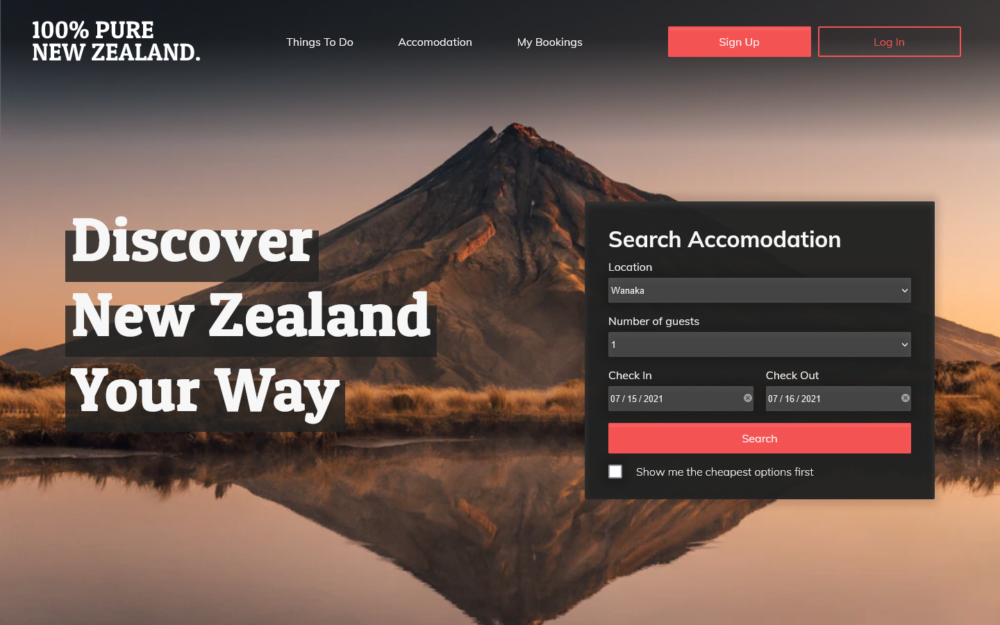
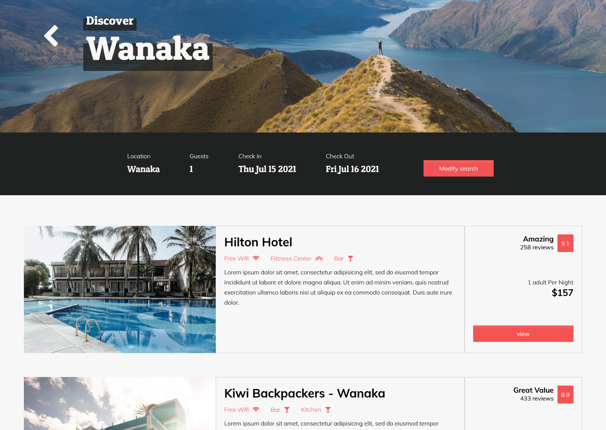

# Accommodation Assignment For Yoobee College
## Project Description

An accommodation booking website made for an assignment at Yoobee College. The site dynamically creates search results with vanilla Js and some Jquery.  

Screenshot of the landing page
  

Screenshot of search results which have been dynamically created

## Javascript Lint review

Throughout development I used gulp and Js Hint for linting. Both returned no errors these warnings:

791	'default parameters' is only available in ES6 (use 'esversion: 6')  
791	'arrow function syntax (=>)' is only available in ES6 (use 'esversion: 6').

These relate to a short snippet of code borrowed from stack overflow which I used to implement a sorting function.

## Javascript Style Guide
I have followed W3 schools style guide along with the use of atom beautify to cover indentations.

## Production Tools
- Gulp  
- Sass
- Js Hint   
- PhotoShop  
- Figma
- Favicon Generator  
- Miro

### Plug-ins
- Fullpage.js
- Parsley.js

### Libraries
- Jquery
- Font Awesome
- Google Fonts
